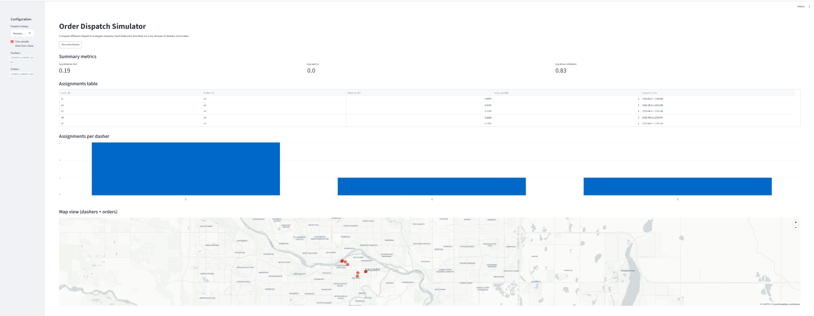

# Order Dispatch Simulator

A small, **backend + dashboard** that simulates assigning **delivery orders → dashers** using different matching strategies.

The project is inspired by on-demand delivery marketplaces and focuses on:

- Matching algorithms (driver–order assignment)
- Operational metrics (distance, wait time, utilization)
- A simple, interactive dashboard to compare strategies

---



---

## Features

**Dispatch strategies**

- `nearest` – greedily picks the geographically closest dasher
- `load_balanced` – prefers dashers with fewer assignments so far, then breaks ties by distance
- `batched` – accumulates orders in a time window and assigns them in batch (introduces non-zero wait times by design)

**Metrics**

For each simulation run:

- Average delivery distance (km)
- Average order wait time (seconds)
- Average driver utilization (relative to capacity)
- Assignments per dasher

**Tech highlights**

- **Backend:** FastAPI, Pydantic
- **Core logic:** Pure Python strategy layer with a simple, pluggable interface
- **Dashboard:** Streamlit (metrics, bar charts, and a small map)
- **Tests:** pytest
- **Data:** JSON sample files for dashers and orders

This makes the repo a nice “systems + data” example for interviews and portfolios.

---

## Project structure

```text
order-dispatch-simulator/
├── app/
│   ├── __init__.py
│   ├── main.py            # FastAPI application (API entrypoint)
│   ├── models.py          # Core domain models (Dasher, Order, Assignment, Metrics, etc.)
│   ├── schemas.py         # Pydantic request/response schemas
│   ├── simulation.py      # Simulation runner + metric computation
│   └── strategies.py      # Nearest, load-balanced, and batched strategies
├── dashboard/
│   └── dashboard_app.py   # Streamlit dashboard
├── data/
│   ├── dashers_sample.json
│   └── orders_sample.json
├── doc/
│   └── order_dispatch.png # UI screenshot
├── tests/
│   ├── __init__.py
│   └── test_simulation.py # Unit tests for strategy & metrics
├── requirements.txt
└── README.md
```

---

## Getting started

### 1. Create and activate a virtual environment

```bash
python -m venv venv
# On macOS / Linux
source venv/bin/activate
# On Windows (PowerShell)
# .\venv\Scripts\Activate.ps1
```

### 2. Install dependencies

```bash
pip install -r requirements.txt
```

---

## Running the API (FastAPI)

From the project root:

```bash
uvicorn app.main:app --reload
```

By default the server runs at: [http://127.0.0.1:8000](http://127.0.0.1:8000)

Useful endpoints:

* `GET /` – small JSON banner with links
* `GET /health` – health check
* `GET /docs` – interactive Swagger UI for all endpoints
* `GET /openapi.json` – OpenAPI schema

### Example: simulate via API

> Exact schema is defined in `app/schemas.py`, but a typical request looks like:

```json
POST /simulate
Content-Type: application/json

{
  "strategy": "nearest",
  "batch_window_seconds": 60,
  "dashers": [
    {
      "id": "d1",
      "capacity": 10,
      "location": {"lat": 51.047, "lng": -114.071}
    },
    {
      "id": "d2",
      "capacity": 8,
      "location": {"lat": 51.05, "lng": -114.08}
    }
  ],
  "orders": [
    {
      "id": "o1",
      "created_at": "2025-01-01T10:00:00Z",
      "location": {"lat": 51.049, "lng": -114.074}
    },
    {
      "id": "o2",
      "created_at": "2025-01-01T10:02:00Z",
      "location": {"lat": 51.045, "lng": -114.069}
    }
  ]
}
```

The response includes:

* Per-order assignments (which dasher, distance, wait time, dispatch time)
* Summary metrics (avg distance, avg wait, avg utilization, assignments per dasher)

---

## Running the dashboard (Streamlit)

The dashboard is a small UI layer on top of the same simulation logic.

From the project root:

```bash
streamlit run dashboard/dashboard_app.py
```

By default the app runs at: [http://localhost:8501](http://localhost:8501)

### What you can do in the dashboard

* Choose a **strategy**: nearest / load-balanced / batched
* For the batched strategy, set the **batch window** (seconds)
* Either:

  * Use bundled sample data in `data/dashers_sample.json` and `data/orders_sample.json`, or
  * Paste your own **dashers** and **orders** JSON into the text areas
* Click **“Run simulation”** to see:

  * Summary metrics (avg distance, avg wait, avg utilization)
  * A table of assignments
  * A bar chart of assignments per dasher
  * A small map with dasher + order locations

---

## Data model (simplified)

Core types are defined in `app/models.py`:

* **Dasher**

  * `id: str`
  * `capacity: int`
  * `location: { lat: float, lng: float }`

* **Order**

  * `id: str`
  * `created_at: datetime`
  * `location: { lat: float, lng: float }`

* **Assignment**

  * `order_id: str`
  * `dasher_id: str`
  * `distance_km: float`
  * `wait_seconds: float`
  * `dispatch_time: datetime`

* **Metrics**

  * `avg_distance_km: float`
  * `avg_wait_seconds: float`
  * `avg_driver_utilization: float`
  * `assignments_per_dasher: dict[str, int]`

---

## Dispatch strategies

Strategies live in `app/strategies.py` and all implement the same interface:

```python
class DispatchStrategy(ABC):
    name: str

    @abstractmethod
    def assign(self, dashers: List[Dasher], orders: List[Order]) -> List[Assignment]:
        ...
```

### NearestDasherStrategy

* For each order (sorted by `created_at`), pick the **geographically closest** dasher.
* Uses a simple haversine distance in km.
* Tracks dasher position and next-available time as they move between orders.

### LoadBalancedStrategy

* For each order, prefers the dasher with the **fewest assignments so far**, then breaks ties by distance.
* Useful to show how balancing load can trade off slightly longer travel vs more even utilization.

### BatchingStrategy

* Groups orders into **time windows** (e.g. 60 seconds).
* At the end of each window, dispatches orders as a batch.
* This naturally leads to **higher wait times** but can model batched assignment behavior.

You can add your own strategy by subclassing `DispatchStrategy` and wiring it up in `app/simulation.get_strategy`.

---

## Testing

Unit tests focus on:

* That each strategy returns reasonable assignments
* That metrics are computed correctly

Run tests from the project root:

```bash
pytest
```

---

## Extending the project

Some ideas if you want to push this further:

* Add **capacity-aware** assignment (respect dasher capacity explicitly)
* Introduce **zone / region** constraints for dashers
* Add **penalties** for long wait times and compare strategies via a single score
* Persist simulations in a database and show historical runs in the dashboard
* Containerize with Docker for a one-command spin-up
